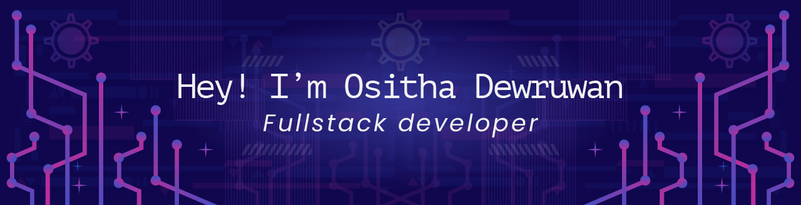

<!--// Header banner -->

    

 

<!--// Typing animation text -->

    

 

<!--// about me table -->
<table align="center">
    <tr>
        <td>
            <!--// About me text -->
            <h2 align="center">🚀 About Me</h2>
             
            

                <ul>
                    <li>🔭 I love developing <b>web apps</b></li>
                    <li>🌱 I'm currently learning <b>Flutter</b></li>
                    <li>💬 Ask me about <b>Next.js, React, Node.js</b></li>
                    <li>📫 Reach me at <b>ositha@ideagraphix.com</b></li>
                </ul>
            

        </td>
        <td>
            <!--// Animated programmer gif -->
            

                
            

        </td>
    </tr>
</table>

<!--// tech stack table -->
<table align="center">
    <tr>
        <td>
            <!--// Languages and tools -->

    <!--// title gif -->
    <picture style="text-align:center">
        <source media="(prefers-color-scheme: dark)" srcset="language-tools-dark.gif" />
        <source media="(prefers-color-scheme: light)" srcset="language-tools-light.gif" />
        
    </picture>
    <!--// logo icons -->
    

        
        
        
        
        
        
         
        
        
        
        
        
        
         
        
        
        
        
        
         
        
        
    

        </td>
        <td>
            <!--// Tech stack text -->

    <h2 style="text-align:center">🛠 Tech Stack</h2>
    <ul>
        <li>💻 Frontend: <b>Next, React, Tailwind CSS</b></li>
        <li>🛠 Backend: <b>Node.js, Express.js</b></li>
        <li>💾 Database: <b>MongoDB, SQL</b></li>
        <li>☁️ Cloud & Deployment: <b>Vercel, Netlify</b></li>
    </ul>

        </td>
    </tr>
</table>

<!--// My info section -->

<!--// GitHub stats -->

    <!--// title gif -->
    <picture style="text-align:center">
        <source media="(prefers-color-scheme: dark)" srcset="github-stats-dark.gif" />
        <source media="(prefers-color-scheme: light)" srcset="github-stats-light.gif" />
        
    </picture>
    <!--// Section 1 -->
    <section >
        <!--// Animated programmer gif 2 -->
        

            
        

        <!--// Most used languages -->
        

            
        

    </section>
    <!--// Section 2 -->
    <section >
        

            
        

        

            
        

    </section>

<!--// Social media -->

    <!--// title gif -->
    <picture style="text-align:center">
        <source media="(prefers-color-scheme: dark)" srcset="connect-with-me-dark.gif" />
        <source media="(prefers-color-scheme: light)" srcset="connect-with-me-light.gif" />
        
    </picture>
    <!--// social links -->
    

        

            
            
            
            
            
        

    

<!--// Random quote -->

    <!--// title gif -->
    <picture style="text-align:center">
        <source media="(prefers-color-scheme: dark)" srcset="random-quote-dark.gif" />
        <source media="(prefers-color-scheme: light)" srcset="random-quote-light.gif" />
        
    </picture>
    <!--// quote -->
    

        
    

<!--// Snake animation -->

    <picture style="text-align:center">
        <source media="(prefers-color-scheme: dark)" srcset="https://raw.githubusercontent.com/Dewruwan95/Dewruwan95/output/github-snake-dark.svg" />
        <source media="(prefers-color-scheme: light)" srcset="https://raw.githubusercontent.com/Dewruwan95/Dewruwan95/output/github-snake.svg" />
        
    </picture>

<!--// Profile views count -->

    

